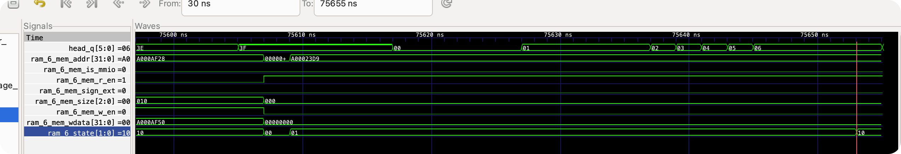
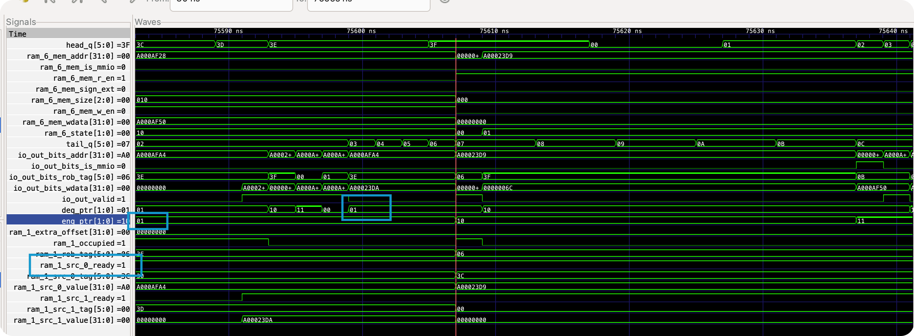
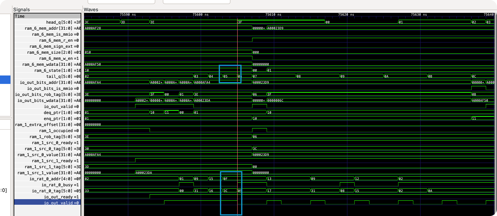

# BUG Report: 遗漏的 RAT 同周期转发

## 现象

一个令人困惑的问题：

- Core 单独接入动态分支预测 —— 没有问题。
- Core 单独接入 ICache —— 没有问题。
- 但 Core + ICache + 动态分支预测 => **boom!**

测试样例：`cpu-tests/hello-str`

## 定位过程

### 1. Difftest 报寄存器 diff

```
===== Register State =====
            DUT           REF
a0     0x000000006c  0x0000000064  <--- MISMATCH
a5     0x00a0001b2a  0x00a0001b2a
```

### 2. ITrace 锁定出错指令

```
===== ITrace (recent 16 instructions) =====
0xa00006d4: 009a87b3  add a5, s5, s1
0xa00006d8: 0007c503  lbu a0, 0(a5)
```

问题出在 `lbu a0, 0(a5)` 上。

### 3. MTrace 发现访存地址异常

```
===== MTrace (recent 16 memory accesses) =====
0xa00006d8: R addr=0xa00006d9 data=0x00006c72 width=1 (lbu a0, 0(a5))
```

`a5` 的值明明是 `0xa0001b2a`，但 `lbu` 却错误地访问了 `0xa00006d9` —— 地址完全不对。

### 4. 波形分析：ROB 状态

访存是晚执行（提交时执行）的操作，因此需要拉取波形进一步分析。



拉取 ROB 的 `head_q`（当前将要提交的指令），观察到以下关键信息：

- `lbu` 占据 ROB 中 `tag=6` 的位置；
- 其访存字段中 `addr = 0xa000_23d9`（错误地址）；
- `head_q=5` 对应的是 `add` 指令，它定义了 `a5`。

**异常现象**：`lbu` 的状态早在 `add` 提交之前就从 `inflight` 变为了 `late`。这是不对的 —— `lbu` 依赖 `add` 写入的 `a5`，只有 `add` 的结果就绪后，`lbu` 才应该变为 `late`。

> **ROB 状态说明**：
> - `inflight`：指令尚未就绪（操作数未到齐或功能单元未完成）；
> - `late`：指令到达 ROB 头部后，进行晚执行（CSR / LSU），完成后进入 `complete`；
> - `complete`：指令到达 ROB 头部时可直接提交。

### 5. 波形分析：AGU 发射队列

`addr` 在 AGU 中计算（`base + offset`），计算完成后根据 `tag` 将对应 ROB 条目从 `inflight` 转为 `late`。
对于 AGU，`src(0)` 是基地址（base），`src(1)` 是写数据（wdata）；若为 load 指令，`src(1)` 始终标记为 ready。



观察 AGU 发射队列的波形，注意到：

- AGU 队列很空闲：`enq_ptr` 从 1 变为 2（`lbu` 入队），短暂停留一个周期后 `deq_ptr` 也变为 2（`lbu` 发射）。
- 停留一个周期是因为寄存器写入下一拍才可见，且发射队列未做旁路。
- **最关键的发现**：`src(0)`（即 `a5`）**入队时就已经是 ready 的**，携带的是一个 value 而非 tag。

发射队列的操作数是一个"枚举"（`ready` 为 value 变体，`!ready` 为 tag 变体）。`ready = true` 说明 rename 阶段就已经将 `a5` 的值取了出来，而不是留给后续 CDB 唤醒。

### 6. 定位根因：Rename 与 Dispatch 的同周期竞争

我的流水线结构如下：

```
(前端) → 解码 → Rename → Dispatch → 发射 → 执行 → 写回 → (晚执行) → 提交
```

采用值捕捉（value-capture）的 Rename 方案。Rename 阶段取值时会考虑以下来源：
1. GPR（寄存器堆）中的值
2. RAT 标签对应的 ROB 条目
3. CDB 广播
4. Dispatch 阶段的 forward（仅限 `jal/jalr/lui/auipc` 等 dispatch 时值已知的指令）

Dispatch 阶段负责：入队 ROB、将指令路由到发射队列。由于 ROB tag 在 Dispatch 阶段才分配，因此 **RAT 的写入发生在 Dispatch 阶段**。

问题在于：`add` 和 `lbu` 紧邻，二者分别处于 Dispatch 和 Rename 阶段（同一个时钟周期）。



波形验证了这一点：

- `tail_q = 5`，下一周期 `tail_q = 6` —— 说明 `add` 正在入队 ROB（即处于 Dispatch 阶段）。
- 此时 `lbu` 正处于 Rename 阶段，查询 RAT 发现 `a5` **不 busy**。

但实际上 `a5` 应该是 busy 的 —— Dispatch 正在同一周期将 `a5` 标记为 `busy` 并写入 `tag=5`。然而 RAT 使用寄存器存储 `busy` 和 `tag`，写入要到**下一个时钟周期才能被读端口看见**。

这就是根因：**RAT 缺少同周期的写→读转发**，导致 Rename 读到了旧的 `busy=false`，直接从 GPR 取出了 `a5` 的过期值。

## 根因

```
周期 N（同一时钟沿）：

  Dispatch (add a5, s5, s1)          Rename (lbu a0, 0(a5))
  ┌──────────────────────┐           ┌──────────────────────┐
  │ RAT 写入:            │           │ RAT 读取:            │
  │   a5 → busy, tag=5   │     ✗     │   a5 → busy? false!  │
  │ (下周期才生效)        │──────────→│   (读到旧值)         │
  └──────────────────────┘           │ GPR 读取:            │
                                     │   a5 = 0xa00006d9    │
                                     │   (过期值, 非 add 的  │
                                     │    结果 0xa0001b2a)  │
                                     └──────────────────────┘
```

Rename 误以为 `a5` 空闲，直接从 GPR 取出了旧值作为 `lbu` 的基地址，导致访存地址错误。

### 为什么只在 ICache + 动态分支预测同时开启时才触发？

这个 bug 本质上是一个时序相关的竞态条件：`add` 必须恰好处于 Dispatch 阶段，而 `lbu` 恰好处于 Rename 阶段。ICache 和动态分支预测改变了取指的时序行为（cache miss 的延迟、预测带来的流水线气泡等），使得两条指令恰好"对齐"到了触发条件。单独使用时时序碰巧避开了这个窗口。


### 反思

因为之前指令供应不足, 并且会频繁的 flush, 导致后端的一些错误被掩盖.
我现在实现了前后端的解耦, 我可以做一件事情: 前端纯软件实现, spike 执行一条指令, 拿到 npc, 取指令, 传给后端.
这样, 分支预测正确率为 100%, 并且指令供应绝对充足, 从而对后端做 "压力测试".

## 修复

在 RAT 内部添加同周期 Dispatch→Rename 转发，类似寄存器堆的写→读旁路：

```scala
// RAT.scala — 读端口增加 disp 写端口的旁路
for (i <- 0 until numReadPorts) {
  val raddr = io.rename(i).addr
  val disp_hit = io.disp.valid && io.disp.bits.addr === raddr && raddr =/= 0.U
  io.rename(i).busy := Mux(disp_hit, true.B, busy(raddr) && raddr =/= 0.U)
  io.rename(i).tag  := Mux(disp_hit, io.disp.bits.tag, tags(raddr))
}
```

同时，还需要在 ROB 的 Rename 前馈端口增加入队旁路。因为 RAT 转发后，Rename 拿到的 tag 是本周期**刚分配**的 `tail_q`，而 ROB 该位置可能残留已提交旧指令的 `rd.state = done`，导致 Rename 误认为值已就绪：

```scala
// ROB.scala — rename 前馈端口增加入队旁路
for (i <- 0 until numFwdPorts) {
  val fwd = io.rename(i)
  val enq_bypass = enq_fire && idx(fwd.tag) === tail_q
  val rd_state = Mux(enq_bypass, io.enq.bits.rd.state, ram(idx(fwd.tag)).rd.state)
  val rd_value = Mux(enq_bypass, io.enq.bits.rd.value, ram(idx(fwd.tag)).rd.value)
  fwd.valid := rd_state === RdRobState.done
  fwd.value := rd_value
}
```
