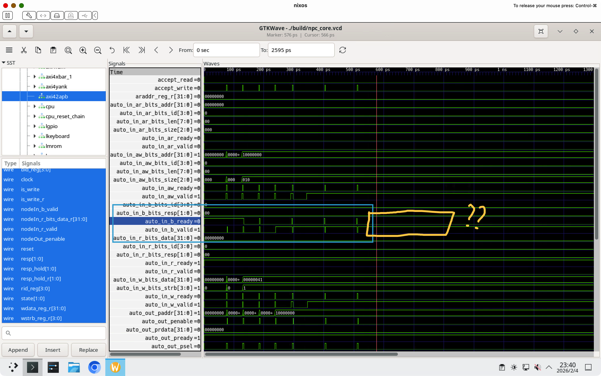
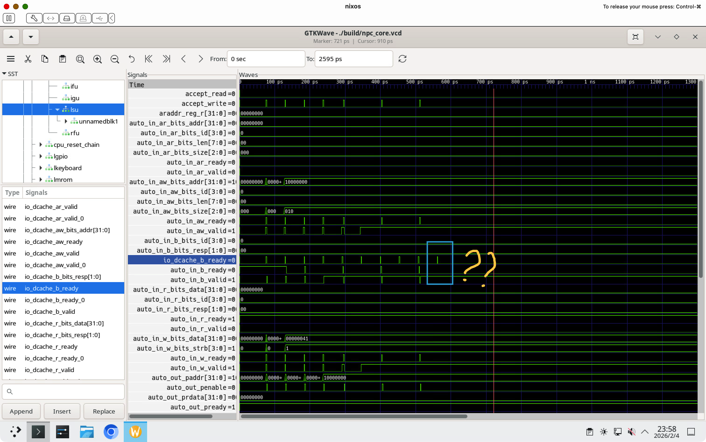

# BUG REPORT: AXI4Xbar B Channel 仲裁器与只读端口冲突

## 问题描述

UART 在输出两个字符后卡死，CPU 无法继续执行写操作。

### 现象

1. 测试程序 `char-test` 向 UART (地址 `0x10000000`) 循环写入字符 'A'
2. 仅输出 "AA" 两个字符后，系统卡死
3. 波形显示 AXI4ToAPB 的 `b.ready` 信号一直为 0，导致写事务无法完成

```txt
wangfiox in 🌐 nixos in npc/resource/char-test on  master [$!?⇡] via C v11.4.0-gcc via ❄️  impure (ysyx-dev-env) 
❯ make run
make -C /home/wangfiox/Documents/ysyx-workbench/npc run IMG=/home/wangfiox/Documents/ysyx-workbench/npc/resource/char-test/char-test.bin
make[1]: Entering directory '/home/wangfiox/Documents/ysyx-workbench/npc'
make -f scripts/native.mk NPC_HOME=/home/wangfiox/Documents/ysyx-workbench/npc
make[2]: Entering directory '/home/wangfiox/Documents/ysyx-workbench/npc'
+ CC src/cxx/memory/mrom.c
+ CXX src/cxx/cpu/core.cc
+ LD /home/wangfiox/Documents/ysyx-workbench/npc/build/riscv32-npc
make[2]: Leaving directory '/home/wangfiox/Documents/ysyx-workbench/npc'
make -f scripts/native.mk NPC_HOME=/home/wangfiox/Documents/ysyx-workbench/npc run IMG=/home/wangfiox/Documents/ysyx-workbench/npc/resource/char-test/char-test.bin
make[2]: Entering directory '/home/wangfiox/Documents/ysyx-workbench/npc'
/home/wangfiox/Documents/ysyx-workbench/npc/build/riscv32-npc --log=/home/wangfiox/Documents/ysyx-workbench/npc/build/npc-log.txt  /home/wangfiox/Documents/ysyx-workbench/npc/resource/char-test/char-test.bin
[src/cxx/utils/log.c:29 init_log] Log is written to /home/wangfiox/Documents/ysyx-workbench/npc/build/npc-log.txt
[src/cxx/memory/mrom.c:39 init_mrom] mrom area [0x20000000, 0x20000fff]
[src/cxx/memory/mrom.c:55 init_mrom] The image is /home/wangfiox/Documents/ysyx-workbench/npc/resource/char-test/char-test.bin, size = 16
[src/cxx/memory/sram.c:34 init_sram] sram area [0x0f000000, 0x0f001fff]
[src/cxx/cpu/core.cc:83 npc_core_init] VCD trace enabled: build/npc_core.vcd
[src/cxx/cpu/core.cc:87 npc_core_init] Verilator core initialized, reset complete
[src/cxx/monitor/monitor.c:32 welcome] Trace: ON
[src/cxx/monitor/monitor.c:35 welcome] If trace is enabled, a log file will be generated to record the trace. This may lead to a large log file. If it is not necessary, you can disable it in menuconfig
[src/cxx/monitor/monitor.c:38 welcome] Build time: 00:00:00, Jan  1 1980
Welcome to riscv32-NPC!
For help, type "help"
(npc) c
AAAAAAA[src/cxx/cpu/core.cc:197 npc_core_step] Warning: npc_core_step exceeded 1000 cycles without debug_commit
[src/cxx/cpu/cpu-exec.c:312 cpu_exec] npc: ABORT at pc = 0x20000008
[src/cxx/cpu/cpu-exec.c:113 dump_iringbuf] Last 16 instructions:
    0x20000004: 04 10 07 93 addi        a5, zero, 0x41
    0x20000008: 00 f4 80 23 sb  a5, 0(s1)
    0x2000000c: ff 9f f0 6f j   -8
    0x20000004: 04 10 07 93 addi        a5, zero, 0x41
    0x20000008: 00 f4 80 23 sb  a5, 0(s1)
    0x2000000c: ff 9f f0 6f j   -8
    0x20000004: 04 10 07 93 addi        a5, zero, 0x41
    0x20000008: 00 f4 80 23 sb  a5, 0(s1)
    0x2000000c: ff 9f f0 6f j   -8
    0x20000004: 04 10 07 93 addi        a5, zero, 0x41
    0x20000008: 00 f4 80 23 sb  a5, 0(s1)
    0x2000000c: ff 9f f0 6f j   -8
    0x20000004: 04 10 07 93 addi        a5, zero, 0x41
    0x20000008: 00 f4 80 23 sb  a5, 0(s1)
    0x2000000c: ff 9f f0 6f j   -8
    0x20000004: 04 10 07 93 addi        a5, zero, 0x41
--> 0x20000008: 00 f4 80 23 sb  a5, 0(s1)
[src/cxx/cpu/cpu-exec.c:246 statistic] host time spent = 1000 us
[src/cxx/cpu/cpu-exec.c:247 statistic] total guest instructions = 32
[src/cxx/cpu/cpu-exec.c:249 statistic] simulation frequency = 32000 inst/s
```




蓝框部分： 信号时序逻辑完全正确。
黄框部分： valid 信号已拉高（有效），但 ready 信号持续为低（无效）。

在排查此 Bug 过程中，我曾遇到 UART 在 115200 波特率下输出若干字符后停止响应的情况，经确认为 UART 内部 FIFO 溢出所致（这进一步印证了 OS 层 I/O 缓冲机制的重要性）。针对该问题，我修改了 `perip/uart16550/rtl/uart_tfifo.v:220` 中的 write 逻辑。

最初我推测是 valid 握手失败，由 UART 侧的反压（Back-pressure）导致 CPU 挂起。但通过观察波形发现，实际情况并非 UART 忙，而是 CPU 端的 b.ready 信号始终未就绪（如上图所示），导致握手阻塞。

我逐层向上溯源 b.ready 信号，我惊讶的发现：cpu侧与总线侧出来的 b.ready 不一样。



经过逐层溯源，我发现了问题

```
UART <- APBFanout <- APBDelayer <- AXI4ToAPB <- AXI4Buffer <- xbar2 <- AXI4UserYanker <- AXI4Fragmenter <- xbar <- CPU
```

## 背景：问题的起源

### 原始场景

MROM 中存放了一段 dummy 测试程序：

```c
// src/cxx/memory/mroc
static const uint32_t builtin_img[] = {
    0x00000297, // auipc t0,0
    0x00028823, // sb  zero,16(t0)  ← 问题指令：尝试写入 MROM 区域！
    0x0102c503, // lbu a0,16(t0)
    0x00100073, // ebreak (used as npc_trap)
    0xdeadbeef, // some data
};
```

第二条指令 `sb zero,16(t0)` 试图向 MROM 区域写入数据。由于 MROM 是只读存储器，这个写操作本应失败。

### 解决方案的选择

为了让 dummy 程序不卡死，有几种可能的解决方案：

1. **修改 MROM 源码，让它空写入**（忽略写操作，不返回响应）
2. **修改 MROM 源码，让 `b.valid`, `aw.ready`, `w.ready` 一直有效**（假装接受写操作）
3. **修改 dummy 程序**（避免写入 MROM）
4. **添加写保护异常机制**

**选择了方案 2**：让 MROM 的写通道信号一直有效，这样即使发生误写入也能完成握手。

### 意外后果

这个修改导致了更严重的问题：**UART 写操作卡死**。

## 根因分析

### 信号追踪

通过波形分析，发现 B channel 的 `ready` 信号在传递过程中丢失：

```
LSU (io_dcache_b_ready) → xbar → ... → AXI4ToAPB (auto_in_b_ready)
        有脉冲                                    始终为 0
```

### 问题定位

问题出在 `AXI4Xbar_1` (xbar2) 的 B channel 仲裁逻辑。

#### SoC 原始拓扑

```
cpu → xbar → Fragmenter → UserYanker → xbar2 → Buffer → AXI4ToAPB → APB devices
                                             → lmrom (只读)
                                             → sramNode
```

#### 生成代码分析 (AXI4Xbar_1.sv)

```systemverilog
// 第 242 行：B channel valid 信号
wire [2:0] readys_valid_1 = {auto_anon_out_2_b_valid, 1'h1, auto_anon_out_0_b_valid};
//                                                    ^^^
//                          MROM (out_1) 的 b_valid 被硬编码为 1！

// 第 262-264 行：B channel 仲裁输出
wire anonIn_b_valid = idle_4 | state_4_0 & auto_anon_out_0_b_valid | state_4_1 | state_4_2 & auto_anon_out_2_b_valid;

// 第 397-398 行：out_0 的 b_ready 生成
assign auto_anon_out_0_b_ready = auto_anon_in_b_ready & (idle_4 ? readys_readys_1[0] : state_4_0);
```

#### 问题机制

1. **Reset 后**：`idle_4 = 1`，此时 `anonIn_b_valid = 1`（因为 `idle_4 | ...`）
2. **仲裁器误选**：由于 MROM 的 `b_valid` 硬编码为 1，当 out_0 和 out_2 都没有 B 响应时，仲裁器会选中端口 1（MROM）
3. **状态锁定**：`state_4_1` 被设为 1，导致 `anonIn_b_valid` 持续为 1，但实际没有真正的 B 响应
4. **ready 阻塞**：`auto_anon_out_0_b_ready` 依赖 `state_4_0`，但 `state_4_0 = 0`，即使上游 ready，也无法传递到 out_0

### 根本原因

**因果链**：

```
MROM 的 b.valid 一直为 1
    ↓
AXI4Xbar 生成代码中 readys_valid_1[1] = 1'h1
    ↓
B channel 仲裁器在空闲时被 MROM 的"假"响应干扰
    ↓
仲裁器状态机锁定在错误状态 (state_4_1 = 1)
    ↓
其他端口（如 UART/APB）的 b_ready 无法正确传递
    ↓
UART 写事务无法完成，系统卡死
```

**核心问题**：Rocket-Chip 的 AXI4Xbar 假设：如果一个端口的 `b.valid` 有效，说明该端口有待处理的写响应。
但当 MROM 为了"兼容"误写入而将 `b.valid` 设为常量 1 时，仲裁器会被这个虚假信号误导，导致无法正确处理其他端口的真实响应。

## 经验总结

### 1. 关于原始问题的反思

对于 "MROM 被误写入会卡死" 这个原始问题，**方案 2（让写通道信号一直有效）是一个危险的选择**。

更好的方案：
- **方案 1（空写入）**：接受写请求但不实际写入，正常返回响应。这需要 MROM 有完整的 AXI 写通道逻辑，但只在收到写请求时才返回响应。
- **方案 3（修改测试程序）**：避免向只读区域写入。
- **方案 4（异常机制）**：返回 SLVERR 响应，通知 CPU 发生了写保护错误。 （后续将采用这种式）

### 2. AXI4Xbar 设计注意事项

当 xbar 的输出端口混合了只读和读写设备时：
- **不要**让只读设备的 `b.valid` 恒为 1
- **要**确保 B channel 信号只在有真实写事务时才有效
- **或者**将只读设备放到独立的路径上

### 3. 调试方法

- 从卡死点开始，逐级追踪握手信号
- 检查生成的 RTL 代码（如 `AXI4Xbar_1.sv`），理解实际硬件行为
- 注意仲裁器状态机的初始状态和转换条件
