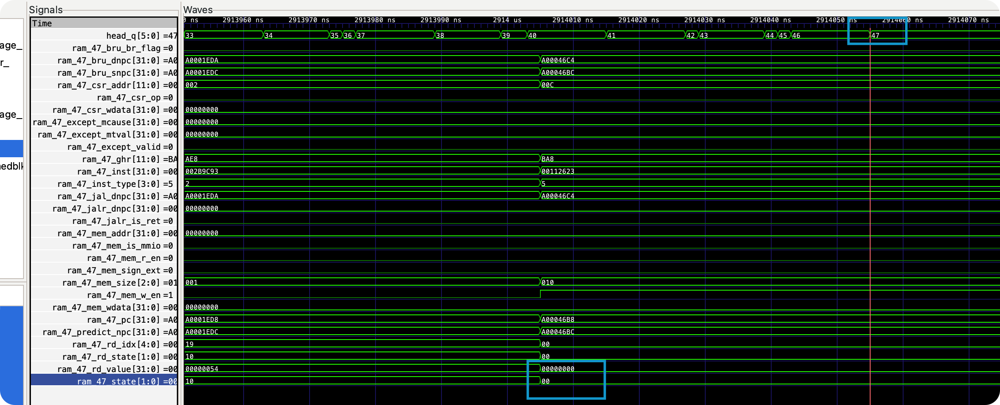
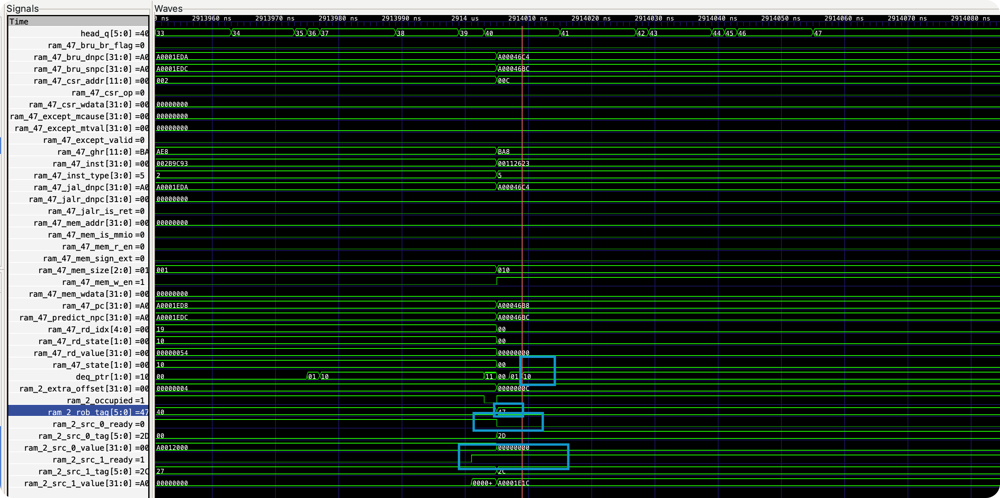
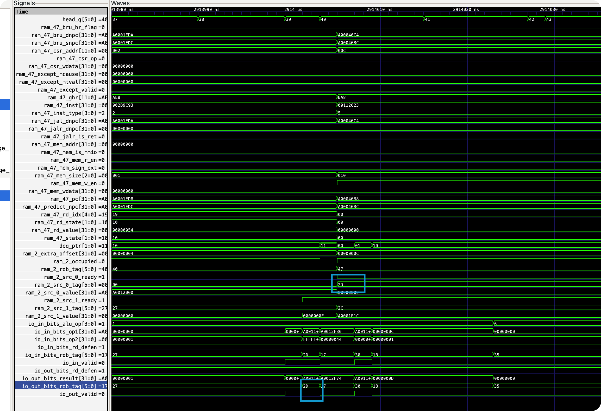
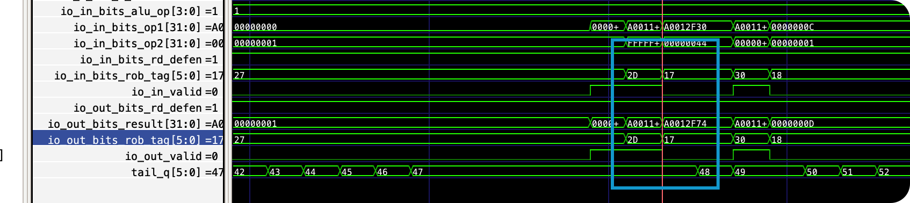
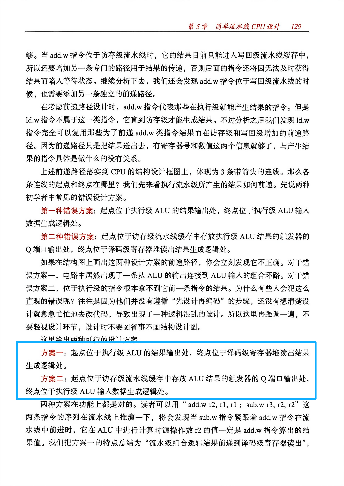
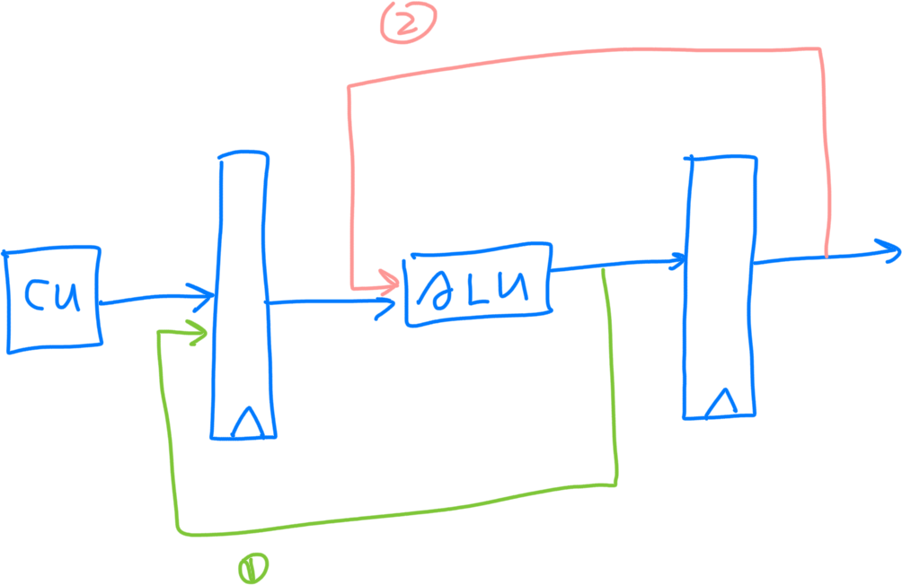
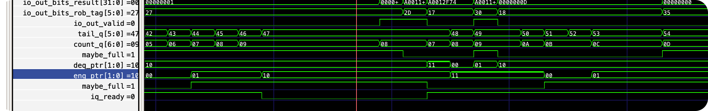

# BUG REPORT: 反压导致流水段寄存器错过 CDB 广播

测试用例：microbench，数据规模：test

## 现象

以下是超时时的 ITrace：

```
===== ITrace (recent 16 instructions) =====
0xa00046b0: ff010113  addi sp, sp, -0x10
0xa00046b4: 00812423  sw s0, 8(sp)
0xa00046b8: 00112623  sw ra, 12(sp)
```

超时的指令是 `sw ra, 12(sp)`。

## 定位过程

### 1. 确认卡死位置



拉取波形后发现：这条指令的状态一直停留在 inflight，即操作数始终未就绪。

### 2. 定位未就绪的操作数



进一步观察 AGU 及其发射队列，发现 src0（即 `sw` 的 rs1，也就是 `sp`）一直未就绪。

这很不合理——既然 `sw s0, 8(sp)` 已经成功执行，说明 `sp` 的值早该可用。但 `sw ra, 12(sp)` 始终认为 `sp` 未就绪。

### 3. 追踪 `sp` 的生产者

`sw ra` 的 ROB tag = 47，往前推算，`addi sp, sp, -0x10` 的 tag = 45。`addi` 走的是 ALU 路径。



观察 ALU 的波形后发现：**tag=45 的 CDB 广播与 tag=47 入队到 AGU 发射队列之间，恰好差了一个周期**——CDB 先广播，tag=47 后入队。这意味着 tag=47 在入队时已经无法通过发射队列的入队 CDB snoop 捕获到这次广播。

### 4. 追问：CDB 广播时 tag=47 在哪？



观察 ROB 的波形发现：`tail_q` 在 47 处停留了相当长的时间。具体来说，tag=45 CDB 广播的下一个周期 tag=47 才入队 ROB，下下个周期 `tail_q` 才推进到 47。

这说明 `sw ra` 在分派阶段被阻塞了——它的信息停留在 Rename → Dispatch 之间的流水段寄存器中。

## 根因分析

回顾设计中 CDB 广播（即数据旁路）的覆盖范围：

- **Rename 阶段**检查 CDB 广播——采用值捕获方式，自然需要旁路。
- **发射队列**检查 CDB 广播——否则队列中的条目永远无法被唤醒。
- **Rename → Dispatch 流水段寄存器**——**遗漏了 CDB snoop**。

当这个流水段寄存器因反压（下游发射队列满）而持有数据时，如果恰好此时 CDB 广播了该指令所等待的 tag，广播信号会被完全错过：Rename 阶段的检查在更早的周期已经完成（当时 CDB 尚未广播），发射队列的入队检查要等到更晚的周期才发生（届时 CDB 已不再广播），而流水段寄存器本身没有 snoop 逻辑。

本质上，CDB 广播等价于经典五级流水线中的数据旁路。



上图是《CPU 设计实战》中关于数据旁路的设计，书中提供了两种方案：



但在我的设计中只能选择方案 1——因为 CDB 广播是一个脉冲信号，仅持续一个周期，无法在下一拍再从组合逻辑中取到。

### 反压的来源



通过波形确认：AGU 发射队列已满，导致 Dispatch 阶段反压，`sw ra` 被迫滞留在 Rename → Dispatch 流水段寄存器中。在此期间 CDB 广播了 tag=45（`sp` 的生产者），但流水段寄存器没有 snoop 逻辑，广播被错过，`sp` 永远无法就绪，形成死锁。

## 修复方案

为 Rename → Dispatch 之间的 `PipelineConnect` 增加 CDB snoop：当流水段寄存器持有有效数据且被反压时，持续监听 CDB，匹配到未就绪的源操作数 tag 时立即更新 `ready` 和 `value`。

将流水线连接代码：

```scala
PipelineConnect(io.in, decodeStage_.io.in, flush)
PipelineConnect(decodeStage_.io.out, renameStage_.io.in, flush)
PipelineConnect(renameStage_.io.out, dispatcher_.io.in, flush)
```

改为：

```scala
PipelineConnect(io.in, decodeStage_.io.in, flush)
PipelineConnect(decodeStage_.io.out, renameStage_.io.in, flush)
PipelineConnect(renameStage_.io.out, dispatcher_.io.in, flush, Seq(cdb1, cdb2))
```

并提供带 CDB snoop 的 `PipelineConnect` 重载：

```scala
def apply(
    prevOut: DecoupledIO[RenameStageOutput],
    thisIn: DecoupledIO[RenameStageOutput],
    flush: Bool,
    cdbs: Seq[ValidIO[CDBBundle]]
): Unit = {
  val pipe_valid = RegInit(false.B)
  val pipe_bits = Reg(new RenameStageOutput)

  // 反压期间持续监听 CDB，更新未就绪的源操作数
  when(pipe_valid && !thisIn.ready && !flush) {
    for (i <- 0 until 2) {
      when(!pipe_bits.src(i).ready) {
        cdbs.reverse.foreach { cdb =>
          when(cdb.valid && pipe_bits.src(i).tag === cdb.bits.tag) {
            pipe_bits.src(i).ready := true.B
            pipe_bits.src(i).value := cdb.bits.value
          }
        }
      }
    }
  }

  when(flush) {
    pipe_valid := false.B
  }.elsewhen(thisIn.ready) {
    pipe_valid := prevOut.valid
    when(prevOut.valid) {
      pipe_bits := prevOut.bits
    }
  }
  prevOut.ready := thisIn.ready
  thisIn.valid := pipe_valid
  thisIn.bits := pipe_bits
}
```
