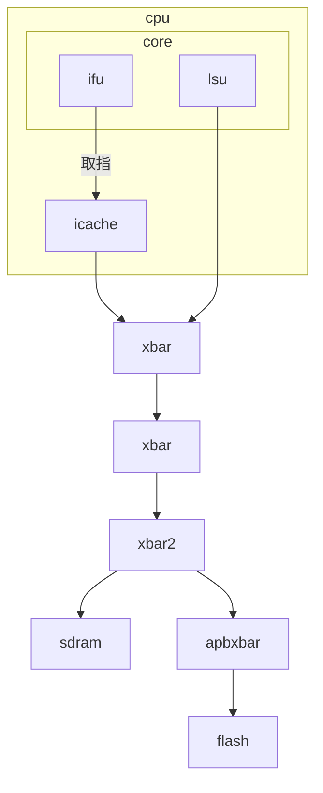
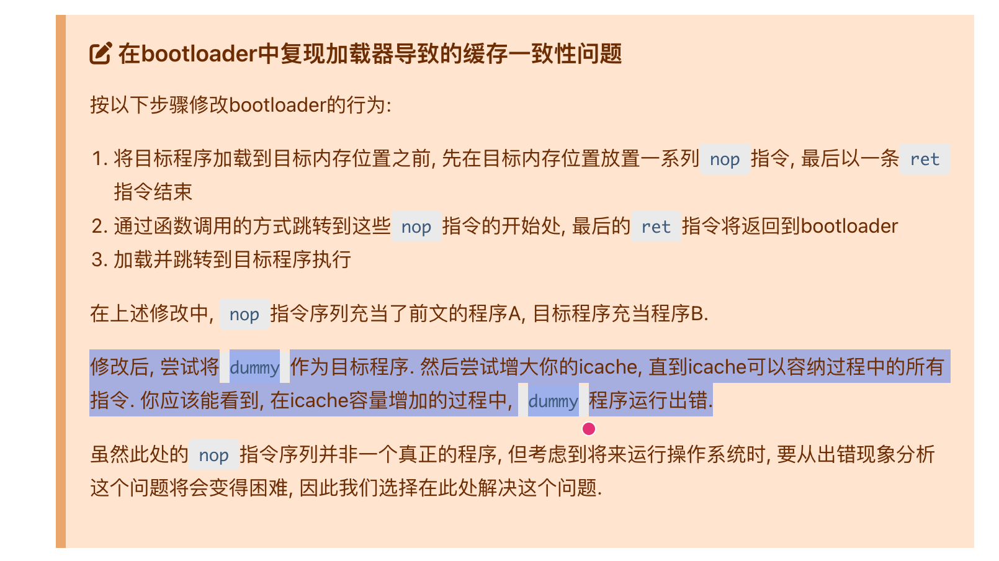

# BUG REPORT: Bootloader 导致的缓存一致性问题

## ICache 的实现思路

我的内存层次结构如下图所示:



核心代码如下:

```scala
class CPU(idBits: Int)(implicit p: Parameters) extends LazyModule {

  private val icacheNode = AXI4MasterNode(Seq(AXI4MasterPortParameters(
    masters = Seq(AXI4MasterParameters(
      name = "icache",
      id   = IdRange(0, 1 << idBits))))))

  private val dcacheNode = AXI4MasterNode(Seq(AXI4MasterPortParameters(
    masters = Seq(AXI4MasterParameters(
      name = "dcache",
      id   = IdRange(0, 1 << idBits))))))

  val masterNode = AXI4Xbar()
  masterNode := AXI4ICache() := icacheNode
  masterNode := dcacheNode

  lazy val module = new Impl
  class Impl extends LazyModuleImp(this) {
    val (icache, _) = icacheNode.out(0)
    val (dcache, _) = dcacheNode.out(0)
    val cpu = Module(new NPCCore)
    icache <> cpu.io.icache
    dcache <> cpu.io.dcache
  }
}
```

从上面的代码可以看出，我将 ICache 接入了 Diplomacy 框架，实现方式参考了 `AXI4Delayer`:

```scala
class AXI4ICache(implicit p: Parameters) extends LazyModule {
  val node = AXI4IdentityNode()
  lazy val module = new Impl
  class Impl extends LazyModuleImp(this) {
    (node.in zip node.out) foreach { case ((in, edgeIn), (out, edgeOut)) =>
      val params = edgeIn.bundle
      val cache = Module(new axi4_icache(params))
      cache.io.in <> in
      out <> cache.io.out
    }
  }
}
object AXI4ICache {
  def apply()(implicit p: Parameters): AXI4Node = {
    val axi4cache = LazyModule(new AXI4ICache)
    axi4cache.node
  }
}
```

ICache 内部的实现思路如下:

```scala
class axi4_icache(params: AXI4BundleParameters) extends Module {
  val io = IO(new AXI4ICacheIO(params))
  // --- state ---
  object State extends ChiselEnum {
    val idle, lookup, refill, r_wait, ar_wait = Value
  }
  private val stateQ = RegInit(State.idle)
  // 状态机, 用于与总线交互, 利用了 axi4 突发传输的特性
  // 思路: 硬件层面实现总线交互, 软件层面实现 cache 的存储与替换策略
}

// cacheline: 64B
// 4-way set associative
// tree-PLRU replacement policy
// 16KB/32KB/64KB cache size
class ICacheCore(params: AXI4BundleParameters) extends Module {
  val io = IO(new Bundle {
    val lookup = new Bundle { /* ... */ }
    val refill = new Bundle { /* ... */ }
  })
  // thin wrapper for dpi-c, which implemented in rust
  private val icache_lookup = Module(new icache_lookup(params))
  private val icache_refill = Module(new icache_refill(params))
  icache_lookup <> io.lookup
  icache_refill <> io.refill
}
```

## 仿真平台的基础设施

为了定位此类问题，我在仿真平台中做了充分的准备工作。
除了常规的寄存器级 difftest 之外，我还实现了**内存级的 difftest**——每当 DUT 执行一条 store 指令，
仿真平台会同步比较 DUT 与参考模型在目标地址上的内存内容:

```rust
pub fn scoreboard(&mut self, dut: &VerilatorCpu) -> StepResult {
    // ...
    if dut.is_mmio() {
        // ...
    } else {
        self.golden.step().unwrap();
        if STORE_MNEMONICS.contains(&mnemonic.as_str()) {
            // mtrace
            let base_val = self.golden.gpr(rs1(inst)).unwrap();
            let addr = (base_val as i32).wrapping_add(imm_s(inst)) as u32;
            let data = self.golden.gpr(rs2(inst)).unwrap();
            let width = mem_width(&mnemonic);
            self.mtrace.push(MTraceEntry::new(
                pc,
                MemDir::Write,
                addr,
                data,
                width,
                &disasm,
            ));
            if !self.check_store_mem(dut, inst, &mnemonic) {
                return StepResult::DifftestFail;
            }
        } else {
            // ...
        }
    }
    // ...
}
```

## BUG 复现

在 cpu-tests 回归测试中，出现了如下错误:

```sh
wangfiox in 🌐 nixos in am-kernels/tests/cpu-tests on  master [⇡] via ❄️  impure (ysyx-dev-env)
# ...
[2026-03-08T09:15:30Z INFO  npc::libdpi::icache] refill: addr=a0000000, data=ff010113, tag=000a0000, idx=0, offset=0
[2026-03-08T09:15:30Z INFO  npc::libdpi::icache] refill: addr=a0000004, data=00812423, tag=000a0000, idx=0, offset=1
[2026-03-08T09:15:30Z INFO  npc::libdpi::icache] refill: addr=a0000008, data=00112623, tag=000a0000, idx=0, offset=2
[2026-03-08T09:15:30Z INFO  npc::libdpi::icache] refill: addr=a000000c, data=01010413, tag=000a0000, idx=0, offset=3
[2026-03-08T09:15:30Z INFO  npc::libdpi::icache] refill: addr=a0000010, data=a00007b7, tag=000a0000, idx=0, offset=4
[2026-03-08T09:15:30Z INFO  npc::libdpi::icache] refill: addr=a0000014, data=a00005b7, tag=000a0000, idx=0, offset=5
[2026-03-08T09:15:30Z INFO  npc::libdpi::icache] refill: addr=a0000018, data=07478793, tag=000a0000, idx=0, offset=6
[2026-03-08T09:15:30Z INFO  npc::libdpi::icache] refill: addr=a000001c, data=34458593, tag=000a0000, idx=0, offset=7
[2026-03-08T09:15:30Z INFO  npc::libdpi::icache] refill: addr=a0000020, data=02b7f263, tag=000a0000, idx=0, offset=8
[2026-03-08T09:15:30Z INFO  npc::libdpi::icache] refill: addr=a0000024, data=300006b7, tag=000a0000, idx=0, offset=9
[2026-03-08T09:15:30Z INFO  npc::libdpi::icache] refill: addr=a0000028, data=0dc68693, tag=000a0000, idx=0, offset=10
[2026-03-08T09:15:30Z INFO  npc::libdpi::icache] refill: addr=a000002c, data=0006c703, tag=000a0000, idx=0, offset=11
[2026-03-08T09:15:30Z INFO  npc::libdpi::icache] refill: addr=a0000030, data=00078613, tag=000a0000, idx=0, offset=12
[2026-03-08T09:15:30Z INFO  npc::libdpi::icache] refill: addr=a0000034, data=00178793, tag=000a0000, idx=0, offset=13
[2026-03-08T09:15:30Z INFO  npc::libdpi::icache] refill: addr=a0000038, data=00e60023, tag=000a0000, idx=0, offset=14
[2026-03-08T09:15:30Z INFO  npc::libdpi::icache] refill: addr=a000003c, data=00168693, tag=000a0000, idx=0, offset=15
[2026-03-08T09:15:30Z INFO  npc::libdpi::icache] refill: addr=a0000040, data=feb796e3, tag=000a0000, idx=1, offset=0
[2026-03-08T09:15:30Z INFO  npc::libdpi::icache] refill: addr=a0000044, data=a00007b7, tag=000a0000, idx=1, offset=1
[2026-03-08T09:15:30Z INFO  npc::libdpi::icache] refill: addr=a0000048, data=a00006b7, tag=000a0000, idx=1, offset=2
[2026-03-08T09:15:30Z INFO  npc::libdpi::icache] refill: addr=a000004c, data=34478793, tag=000a0000, idx=1, offset=3
[2026-03-08T09:15:30Z INFO  npc::libdpi::icache] refill: addr=a0000050, data=34468693, tag=000a0000, idx=1, offset=4
[2026-03-08T09:15:30Z INFO  npc::libdpi::icache] refill: addr=a0000054, data=00d7f863, tag=000a0000, idx=1, offset=5
[2026-03-08T09:15:30Z INFO  npc::libdpi::icache] refill: addr=a0000058, data=00078023, tag=000a0000, idx=1, offset=6
[2026-03-08T09:15:30Z INFO  npc::libdpi::icache] refill: addr=a000005c, data=00178793, tag=000a0000, idx=1, offset=7
[2026-03-08T09:15:30Z INFO  npc::libdpi::icache] refill: addr=a0000060, data=fed79ce3, tag=000a0000, idx=1, offset=8
[2026-03-08T09:15:30Z INFO  npc::libdpi::icache] refill: addr=a0000064, data=00812403, tag=000a0000, idx=1, offset=9
[2026-03-08T09:15:30Z INFO  npc::libdpi::icache] refill: addr=a0000068, data=00c12083, tag=000a0000, idx=1, offset=10
[2026-03-08T09:15:30Z INFO  npc::libdpi::icache] refill: addr=a000006c, data=01010113, tag=000a0000, idx=1, offset=11
[2026-03-08T09:15:30Z INFO  npc::libdpi::icache] refill: addr=a0000070, data=11c0006f, tag=000a0000, idx=1, offset=12
[2026-03-08T09:15:30Z INFO  npc::libdpi::icache] refill: addr=a0000074, data=00000063, tag=000a0000, idx=1, offset=13
[2026-03-08T09:15:30Z INFO  npc::libdpi::icache] refill: addr=a0000078, data=00000000, tag=000a0000, idx=1, offset=14
[2026-03-08T09:15:30Z INFO  npc::libdpi::icache] refill: addr=a000007c, data=00000000, tag=000a0000, idx=1, offset=15
[2026-03-08T09:15:30Z ERROR npc::libsdb::scoreboard] difftest FAIL: pc  dut=0xa0000074  ref=0xa0000078
[2026-03-08T09:15:30Z ERROR npc::libsdb::sdb] difftest failed
[2026-03-08T09:15:30Z ERROR npc::libsdb::scoreboard] ===== ITrace (recent 16 instructions) =====
[2026-03-08T09:15:30Z ERROR npc::libsdb::scoreboard] 0xa00000d4: 324b8b13  addi s6, s7, 0x324
    0xa00000d8: 224a0a13  addi s4, s4, 0x224
    0xa00000dc: 34498993  addi s3, s3, 0x344
    0xa00000e0: 00000a93  mv s5, zero
    0xa00000e4: 04000c13  addi s8, zero, 0x40
    0xa00000e8: 000b2903  lw s2, 0(s6)
    0xa00000ec: 000a0c93  mv s9, s4
    0xa00000f0: 324b8493  addi s1, s7, 0x324
    0xa00000f4: 0004a503  lw a0, 0(s1)
    0xa00000f8: 000ca783  lw a5, 0(s9)
    0xa00000fc: 00448493  addi s1, s1, 4
    0xa0000100: 00a90533  add a0, s2, a0
    0xa0000104: 40f50533  sub a0, a0, a5
    0xa0000108: 00153513  seqz a0, a0
    0xa000010c: f69ff0ef  jal -0x98
    0xa0000074: 00000063  beqz zero, 0
[2026-03-08T09:15:30Z ERROR npc::libsdb::scoreboard] ===== FTrace (recent calls) =====
[2026-03-08T09:15:30Z ERROR npc::libsdb::scoreboard] 0x3000000c: call [fsbl@0x30000010] (jal 4)
    0xa00001d4:   call [main@0xa0000094] (jal -0x140)
    0xa000010c:     call [check@0xa0000074] (jal -0x98)
# ...
Error:   × abort
```

## 分析过程

DUT 最后执行的一条指令是:

```riscv
0xa0000074: 00000063  beqz zero, 0
```

这意味着 DUT 取到的指令是错误的。查看 ELF 的反汇编，该地址处的正确指令应当是:

```riscv
a0000074:       00050463                beqz    a0,a000007c <check+0x8>
```

对比可以发现: DUT 取到的指令编码为 `0x00000063`，其高 24 位全部为零，
而正确的编码应当是 `0x00050463`。指令被"截断"了。

注意到 `0xa000_0074` 对应的恰好是 `check` 函数的入口地址，
而 `check` 位于应用程序的 `.text` 段中，是 ssbl 负责从 ROM 加载到 DRAM 的内容。
ssbl 的加载过程已经通过了内存级 difftest 的校验，说明**数据确实被正确写入了内存**。

以下是 ssbl 与应用程序的反汇编:

```riscv
Disassembly of section .text.ssbl:

a0000000 <ssbl>:
a0000000:       ff010113                addi    sp,sp,-16
a0000004:       00812423                sw      s0,8(sp)
a0000008:       00112623                sw      ra,12(sp)
a000000c:       01010413                addi    s0,sp,16
a0000010:       a00007b7                lui     a5,0xa0000
a0000014:       a00005b7                lui     a1,0xa0000
a0000018:       07478793                addi    a5,a5,116 # a0000074 <_ssbl_vma_end>
a000001c:       34458593                addi    a1,a1,836 # a0000344 <_app_vma_end>
a0000020:       02b7f263                bgeu    a5,a1,a0000044 <ssbl+0x44>
a0000024:       300006b7                lui     a3,0x30000
a0000028:       0dc68693                addi    a3,a3,220 # 300000dc <_app_lma>
a000002c:       0006c703                lbu     a4,0(a3)
a0000030:       00078613                mv      a2,a5
a0000034:       00178793                addi    a5,a5,1
a0000038:       00e60023                sb      a4,0(a2)
a000003c:       00168693                addi    a3,a3,1
a0000040:       feb796e3                bne     a5,a1,a000002c <ssbl+0x2c>
a0000044:       a00007b7                lui     a5,0xa0000
a0000048:       a00006b7                lui     a3,0xa0000
a000004c:       34478793                addi    a5,a5,836 # a0000344 <_app_vma_end>
a0000050:       34468693                addi    a3,a3,836 # a0000344 <_app_vma_end>
a0000054:       00d7f863                bgeu    a5,a3,a0000064 <ssbl+0x64>
a0000058:       00078023                sb      zero,0(a5)
a000005c:       00178793                addi    a5,a5,1
a0000060:       fed79ce3                bne     a5,a3,a0000058 <ssbl+0x58>
a0000064:       00812403                lw      s0,8(sp)
a0000068:       00c12083                lw      ra,12(sp)
a000006c:       01010113                addi    sp,sp,16
a0000070:       11c0006f                j       a000018c <_trm_init>

Disassembly of section .text:

a0000074 <check>:
a0000074:       00050463                beqz    a0,a000007c <check+0x8>
a0000078:       00008067                ret
a000007c:       ff010113                addi    sp,sp,-16
a0000080:       00812423                sw      s0,8(sp)
a0000084:       00112623                sw      ra,12(sp)
a0000088:       01010413                addi    s0,sp,16
a000008c:       00100513                li      a0,1
a0000090:       0e0000ef                jal     a0000170 <halt>
// ...
```

通过 SDB 调试，我定位到: 地址 `0xa000_0038` 处的 `sb` 指令在 ssbl 的拷贝循环中，
正是它在某一时刻向 `0xa000_0074` 写入了应用程序的数据。

进一步跟踪波形后发现: DUT 在执行完 `0xa000_0038`（`sb a4, 0(a2)`）之后，
即将取 `0xa000_0040` 处的下一条指令时，触发了一次 **compulsory cache miss**。

从 Rust 层面的 refill 日志中可以清晰地看到这一过程:

```sh
[2026-03-08T09:15:30Z INFO  npc::libdpi::icache] refill: addr=a0000040, data=feb796e3, tag=000a0000, idx=1, offset=0
# ...
[2026-03-08T09:15:30Z INFO  npc::libdpi::icache] refill: addr=a0000074, data=00000063, tag=000a0000, idx=1, offset=13
[2026-03-08T09:15:30Z INFO  npc::libdpi::icache] refill: addr=a0000078, data=00000000, tag=000a0000, idx=1, offset=14
[2026-03-08T09:15:30Z INFO  npc::libdpi::icache] refill: addr=a000007c, data=00000000, tag=000a0000, idx=1, offset=15
```

包含 `0xa000_0040` 的 cacheline 只被 refill 了一次（完整日志中也仅此一次）。
这是必然的——在未执行 cache flush 的情况下，该 cacheline 一旦被加载到 ICache 中，
后续的取指操作将直接命中，不会再次从内存中读取。

**问题的关键在于**: 这次 refill 发生时，ssbl 的拷贝循环**尚未完成**。
此时 `0xa000_0074` 处的内存内容还是旧数据（`0x00000063`），
而非应用程序最终写入的正确指令（`0x00050463`）。
等到 ssbl 后续通过 `sb` 指令将正确数据写入了内存中的 `0xa000_0074`，
ICache 中的陈旧副本却不会被更新——**内存与 ICache 出现了不一致**。

## 根因

问题的根因是: **ssbl 的代码段与应用程序的代码段落在了同一个 cacheline 中**。

具体而言，ssbl 的 `.text.ssbl` 段结束于 `0xa000_0074`（`_ssbl_vma_end`），
而应用程序的 `.text` 段紧接其后，从 `0xa000_0074` 开始。
在我的 ICache 配置下（cacheline = 64B），地址 `0xa000_0040 ~ 0xa000_007f`
属于同一个 cacheline。这意味着 ssbl 执行到 `0xa000_0040` 附近时，
ICache 会将整个 cacheline（包括尚未被 ssbl 写入的应用程序区域）一并加载进来。

讲义中也有相关提示:



## 解决方案

讲义中提到的通用解法是: 在合适的位置插入 `fence.i` 指令来刷新 ICache。

但在插入 `fence.i` 之前，还有一个更直接的缓解手段:
**在链接脚本中将 ssbl 段按 cacheline 大小对齐**，确保 ssbl 与应用程序不会共享同一个 cacheline:

```linker
  .text.ssbl : {
    _ssbl_vma_start = .;
    *ssbl.o(.text*)
    *ssbl.o(.rodata*)
    *ssbl.o(.srodata*)
    _ssbl_vma_end = .;
    . = ALIGN(64); /* 按 cacheline 大小对齐 */
  } > dram AT> irom
  _ssbl_lma = LOADADDR(.text.ssbl);

  .text : {
    _app_vma_start = .;
    *(.text*)
  } > dram AT> irom
  _app_lma = LOADADDR(.text);
```

## 关于 `fence.i` 的放置位置

即便做了对齐，仍有必要思考 `fence.i` 的放置策略:

1. **fsbl 与 ssbl 之间不存在此问题**: fsbl 位于 `0x3000_0000`，ssbl 位于 `0xa000_0000`，
   二者地址相距甚远，不可能落入同一个 cacheline。

2. **ssbl 与应用程序之间**: 严格来说，每次通过 store 指令修改了即将被取指的地址空间后，
   都应当执行 `fence.i`。但实际上不必如此频繁——
   只需在 ssbl 完成拷贝、**即将跳转到应用程序之前**插入一条 `fence.i` 即可。
   因为应用程序开始执行时，取指一定会触发 compulsory cache miss，
   从内存中加载到的必然是最新的指令。

## 总结

引入 ICache 后，编程模型受到了额外的约束:
**不能出现同一个 cacheline 内"自修改代码"（self-modifying code）而未执行 `fence.i` 的情况**。
Bootloader 场景下的拷贝操作恰好触发了这一约束，
本质上是经典的 **I/D cache 一致性问题**在嵌入式启动流程中的具体体现。
