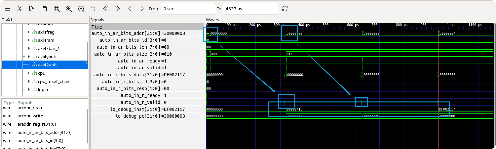
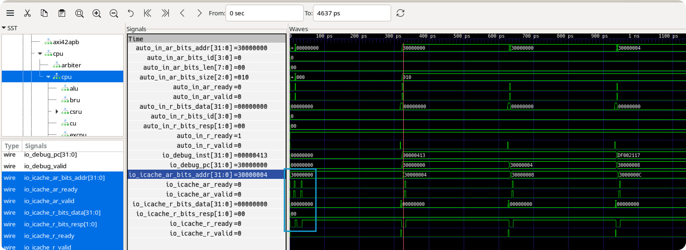
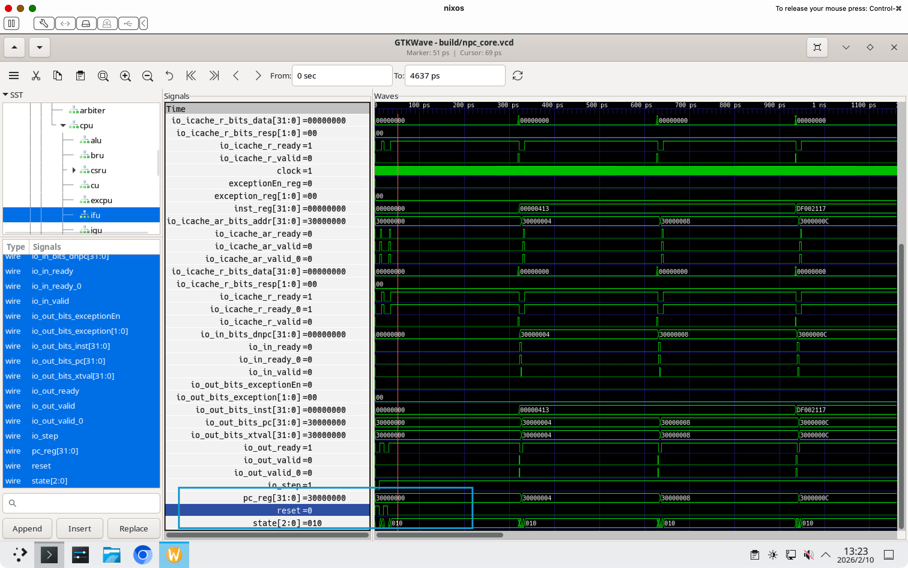

# BUG REPORT: 异常复位导致指令重复执行

## 问题现象

在将 XIP Flash 接入作为 IROM 后，出现了指令重复执行的异常现象：

```
wangfiox in 🌐 nixos in am-kernels/tests/cpu-tests on  master [!] via ❄️  impure (ysyx-dev-env) took 8s
❯ make run ALL=add
# Building add-run [riscv32-npc]
# Building am-archive [riscv32-npc]
# Building klib-archive [riscv32-npc]
+ OBJCOPY -> build/add-riscv32-npc.bin
mainargs=
make[5]: Circular libriscv.so <- libriscv.so dependency dropped.
make[5]: Circular libcustomext.so <- libcustomext.so dependency dropped.
make[5]: Circular libsoftfloat.so <- libsoftfloat.so dependency dropped.
[src/cxx/utils/log.c:29 init_log] Log is written to /home/wangfiox/Documents/ysyx-workbench/am-kernels/tests/cpu-tests/build/npc-log.txt
[src/cxx/memory/flash.c:36 init_flash] Flash area [0x30000000, 0x3fffffff]
[src/cxx/memory/flash.c:53 init_flash] The image is /home/wangfiox/Documents/ysyx-workbench/am-kernels/tests/cpu-tests/build/add-riscv32-npc.bin, size = 816
[src/cxx/cpu/core.cc:86 npc_core_init] VCD trace enabled: build/npc_core.vcd
[src/cxx/memory/sram.c:37 init_sram] sram area [0x0f000000, 0x0f001fff], verilator ptr = 0xb2621a8
[src/cxx/cpu/core.cc:98 npc_core_init] Verilator core initialized, reset complete
[src/cxx/cpu/difftest/dut.c:84 init_difftest] Differential testing: ON
[src/cxx/cpu/difftest/dut.c:85 init_difftest] The result of every instruction will be compared with /home/wangfiox/Documents/ysyx-workbench/npc/tools/spike-diff/build/riscv32-spike-so. This will help you a lot for debugging, but also significantly reduce the performance. If it is not necessary, you can turn it off in menuconfig.
[src/cxx/monitor/monitor.c:33 welcome] Trace: ON
[src/cxx/monitor/monitor.c:36 welcome] If trace is enabled, a log file will be generated to record the trace. This may lead to a large log file. If it is not necessary, you can disable it in menuconfig
[src/cxx/monitor/monitor.c:39 welcome] Build time: 00:00:00, Jan  1 1980
Welcome to riscv32-NPC!
For help, type "help"
(npc) si
[XIP] Capture: in.paddr=0x30000000, flashAddr=0x000000
[XIP] TX1_Setup: flashAddr=0x000000, tx1Val=0x03000000
[src/cxx/memory/flash.c:93 flash_read] flash_read(addr=0x00000000) -> data=0x00000413
[XIP] Capture: in.paddr=0x30000000, flashAddr=0x000000
0x30000000: 00 00 04 13 mv      s0, zero （第一条指令，正确的）
(npc)
[XIP] TX1_Setup: flashAddr=0x000000, tx1Val=0x03000000
[src/cxx/memory/flash.c:93 flash_read] flash_read(addr=0x00000000) -> data=0x00000413
[XIP] Capture: in.paddr=0x30000004, flashAddr=0x000004
0x30000004: 00 00 04 13 mv s0, zero （第二条指令应该要执行 auipc sp,0xdf002，但是这里却依然执行的是mv s0,zero）

+------+------------+------------+----------+
|   Difftest FAILED at PC = 0x30000004    |
+------+------------+------------+----------+
| Reg  | REF        | NPC        | Status   |
+------+------------+------------+----------+
| $0   | 0x00000000 | 0x00000000 | OK       |
| ra   | 0x00000000 | 0x00000000 | OK       |
| sp   | 0x0f002004 | 0x00000000 | MISMATCH |
| gp   | 0x00000000 | 0x00000000 | OK       |
| tp   | 0x00000000 | 0x00000000 | OK       |
| t0   | 0x00000000 | 0x00000000 | OK       |
| t1   | 0x00000000 | 0x00000000 | OK       |
| t2   | 0x00000000 | 0x00000000 | OK       |
| s0   | 0x00000000 | 0x00000000 | OK       |
| s1   | 0x00000000 | 0x00000000 | OK       |
| a0   | 0x00000000 | 0x00000000 | OK       |
| a1   | 0x00000000 | 0x00000000 | OK       |
| a2   | 0x00000000 | 0x00000000 | OK       |
| a3   | 0x00000000 | 0x00000000 | OK       |
| a4   | 0x00000000 | 0x00000000 | OK       |
| a5   | 0x00000000 | 0x00000000 | OK       |
| a6   | 0x00000000 | 0x00000000 | OK       |
| a7   | 0x00000000 | 0x00000000 | OK       |
| s2   | 0x00000000 | 0x00000000 | OK       |
| s3   | 0x00000000 | 0x00000000 | OK       |
| s4   | 0x00000000 | 0x00000000 | OK       |
| s5   | 0x00000000 | 0x00000000 | OK       |
| s6   | 0x00000000 | 0x00000000 | OK       |
| s7   | 0x00000000 | 0x00000000 | OK       |
| s8   | 0x00000000 | 0x00000000 | OK       |
| s9   | 0x00000000 | 0x00000000 | OK       |
| s10  | 0x00000000 | 0x00000000 | OK       |
| s11  | 0x00000000 | 0x00000000 | OK       |
| t3   | 0x00000000 | 0x00000000 | OK       |
| t4   | 0x00000000 | 0x00000000 | OK       |
| t5   | 0x00000000 | 0x00000000 | OK       |
| t6   | 0x00000000 | 0x00000000 | OK       |
+------+------------+------------+----------+
| pc   | 0x30000008 | 0x30000008 | OK       |
+------+------------+------------+----------+

(npc)
[XIP] TX1_Setup: flashAddr=0x000004, tx1Val=0x03000004
[src/cxx/memory/flash.c:93 flash_read] flash_read(addr=0x00000004) -> data=0xdf002117
[XIP] Capture: in.paddr=0x30000008, flashAddr=0x000008
0x30000008: df 00 21 17 auipc sp, 0xdf002 （这里执行的竟然是 0x3000_0004 处的指令）

+------+------------+------------+----------+
|   Difftest FAILED at PC = 0x30000008    |
+------+------------+------------+----------+
| Reg  | REF        | NPC        | Status   |
+------+------------+------------+----------+
| $0   | 0x00000000 | 0x00000000 | OK       |
| ra   | 0x00000000 | 0x00000000 | OK       |
| sp   | 0x0f002000 | 0x0f002008 | MISMATCH |
| gp   | 0x00000000 | 0x00000000 | OK       |
| tp   | 0x00000000 | 0x00000000 | OK       |
| t0   | 0x00000000 | 0x00000000 | OK       |
| t1   | 0x00000000 | 0x00000000 | OK       |
| t2   | 0x00000000 | 0x00000000 | OK       |
| s0   | 0x00000000 | 0x00000000 | OK       |
| s1   | 0x00000000 | 0x00000000 | OK       |
| a0   | 0x00000000 | 0x00000000 | OK       |
| a1   | 0x00000000 | 0x00000000 | OK       |
| a2   | 0x00000000 | 0x00000000 | OK       |
| a3   | 0x00000000 | 0x00000000 | OK       |
| a4   | 0x00000000 | 0x00000000 | OK       |
| a5   | 0x00000000 | 0x00000000 | OK       |
| a6   | 0x00000000 | 0x00000000 | OK       |
| a7   | 0x00000000 | 0x00000000 | OK       |
| s2   | 0x00000000 | 0x00000000 | OK       |
| s3   | 0x00000000 | 0x00000000 | OK       |
| s4   | 0x00000000 | 0x00000000 | OK       |
| s5   | 0x00000000 | 0x00000000 | OK       |
| s6   | 0x00000000 | 0x00000000 | OK       |
| s7   | 0x00000000 | 0x00000000 | OK       |
| s8   | 0x00000000 | 0x00000000 | OK       |
| s9   | 0x00000000 | 0x00000000 | OK       |
| s10  | 0x00000000 | 0x00000000 | OK       |
| s11  | 0x00000000 | 0x00000000 | OK       |
| t3   | 0x00000000 | 0x00000000 | OK       |
| t4   | 0x00000000 | 0x00000000 | OK       |
| t5   | 0x00000000 | 0x00000000 | OK       |
| t6   | 0x00000000 | 0x00000000 | OK       |
+------+------------+------------+----------+
| pc   | 0x3000000c | 0x3000000c | OK       |
+------+------------+------------+----------+

(npc)
[XIP] TX1_Setup: flashAddr=0x000008, tx1Val=0x03000008
[src/cxx/memory/flash.c:93 flash_read] flash_read(addr=0x00000008) -> data=0xffc10113
[XIP] Capture: in.paddr=0x3000000c, flashAddr=0x00000c
0x3000000c: ff c1 01 13 addi    sp, sp, -4 （后面都是累积误差了）

+------+------------+------------+----------+
|   Difftest FAILED at PC = 0x3000000c    |
+------+------------+------------+----------+
| Reg  | REF        | NPC        | Status   |
+------+------------+------------+----------+
| $0   | 0x00000000 | 0x00000000 | OK       |
| ra   | 0x00000000 | 0x00000000 | OK       |
| sp   | 0x0f002000 | 0x0f002004 | MISMATCH |
| gp   | 0x00000000 | 0x00000000 | OK       |
| tp   | 0x00000000 | 0x00000000 | OK       |
| t0   | 0x00000000 | 0x00000000 | OK       |
| t1   | 0x00000000 | 0x00000000 | OK       |
| t2   | 0x00000000 | 0x00000000 | OK       |
| s0   | 0x00000000 | 0x00000000 | OK       |
| s1   | 0x00000000 | 0x00000000 | OK       |
| a0   | 0x0f00000c | 0x00000000 | MISMATCH |
| a1   | 0x00000000 | 0x00000000 | OK       |
| a2   | 0x00000000 | 0x00000000 | OK       |
| a3   | 0x00000000 | 0x00000000 | OK       |
| a4   | 0x00000000 | 0x00000000 | OK       |
| a5   | 0x00000000 | 0x00000000 | OK       |
| a6   | 0x00000000 | 0x00000000 | OK       |
| a7   | 0x00000000 | 0x00000000 | OK       |
| s2   | 0x00000000 | 0x00000000 | OK       |
| s3   | 0x00000000 | 0x00000000 | OK       |
| s4   | 0x00000000 | 0x00000000 | OK       |
| s5   | 0x00000000 | 0x00000000 | OK       |
| s6   | 0x00000000 | 0x00000000 | OK       |
| s7   | 0x00000000 | 0x00000000 | OK       |
| s8   | 0x00000000 | 0x00000000 | OK       |
| s9   | 0x00000000 | 0x00000000 | OK       |
| s10  | 0x00000000 | 0x00000000 | OK       |
| s11  | 0x00000000 | 0x00000000 | OK       |
| t3   | 0x00000000 | 0x00000000 | OK       |
| t4   | 0x00000000 | 0x00000000 | OK       |
| t5   | 0x00000000 | 0x00000000 | OK       |
| t6   | 0x00000000 | 0x00000000 | OK       |
+------+------------+------------+----------+
| pc   | 0x30000010 | 0x30000010 | OK       |
+------+------------+------------+----------+
```

**结论：Flash 的第一条指令被重复执行了一次。**

---

## 问题定位过程

### 1. 初步排查：XIP 模块

由于之前的测试均正常通过，问题仅在将 MROM 替换为 Flash 后才出现，因此首先怀疑是 XIP 模块的问题。

拉取 XIP 模块的波形后发现：前两次访问的地址都是 `0x3000_0000`，这不符合预期。

### 2. 向上溯源：AXI4toAPB

继续向上溯源，检查 AXI4toAPB 模块，发现同样存在地址异常：



更诡异的是，AR 通道的地址变化呈现以下规律：

```
0 → 0x3000_0000(短暂) → 0 → 0x3000_0000 → 0x3000_0004(短暂) → 0x3000_0000
  → 0x3000_0004 → 0x3000_0008(短暂) → 0x3000_0004 → ...
```

### 3. 继续溯源：ICache

既然 AXI4toAPB 接收到的地址已经是错误的，问题应该出在更上游。于是拉取 CPU Core 中 ICache 的波形：



发现 ICache 的 AR 通道连续握手了两次，且两次握手的地址都是 `0x3000_0000`——这就是问题的直接原因。

然而按照 IFU 状态机的设计，AR 不应该连续握手两次：必须等到 R 通道握手成功（即成功取到指令）后，AR 才能发起下一次握手。

### 4. 最终定位：IFU 异常复位

问题似乎只能出在 IFU 模块中。但 IFU 已经是"久经考验"的模块——通过了多周期回归测试，也通过了接入 MROM 的回归测试，理论上不应该出现问题。

于是完整拉取了 IFU 的波形：



**令人惊讶的发现：IFU 竟然被复位了两次，但仿真平台明明只进行了一次复位操作！**

---

## 根因分析

追溯复位信号的传递路径后，找到了问题的根源。

### 仿真平台的复位逻辑

仿真平台产生复位信号的代码如下：

```cpp
// src/cxx/cpu/core.cc
static void reset(int cycles = 5) {
  top->reset = 1;
  for (int i = 0; i < cycles; i++) { tick(); }
  top->reset = 0;
}
```

仿真平台将复位信号拉高 **5 个周期**后释放。

### SoC 中的复位延迟设计

然而，SoC 中对 CPU 的复位信号做了特殊处理：

```scala
// src/scala/SoC.scala
class ysyxSoCASIC(implicit p: Parameters) extends LazyModule {
  override lazy val module = new Impl
  class Impl extends LazyModuleImp(this) with DontTouch {
    // generate delayed reset for cpu, since chiplink should finish reset
    // to initialize some async modules before accept any requests from cpu
    cpu.module.reset := SynchronizerShiftReg(reset.asBool, 10) || reset.asBool
  }
}
```

这段代码的设计意图是：**CPU 的复位释放比全局复位延迟 10 个周期**。

原因是 ChipLink 会外接 FPGA，FPGA 内部也有复位相关的初始化操作。CPU 作为 Master，是所有总线事务的发起者，延迟释放复位可以确保外设先于 CPU 完成初始化，避免 CPU 向尚未就绪的外设发送请求。

### 问题的本质

关键在于：**只有 CPU 需要延迟复位释放，总线等其他模块不需要延迟**。

当仿真平台只复位 5 个周期时，时序如下：

```
全局 reset:     ██████████__________________________________________
                ↑ 0周期   ↑ 5周期释放

CPU reset:      ██████████████████████______________________________
                ↑ 0周期              ↑ 15周期释放 (5+10)

总线/外设:      ██████████__________________________________________
                ↑ 0周期   ↑ 5周期释放
```

问题发生的过程：

1. **第 0~5 周期**：全局复位有效，CPU 和总线都处于复位状态
2. **第 5 周期**：全局复位释放，总线开始正常工作
3. **第 5~10 周期**：CPU 仍处于复位状态（延迟尚未结束），但移位寄存器开始传播
4. **第 10 周期**：延迟的复位信号通过移位寄存器到达，CPU 再次被复位
5. **问题**：如果 CPU 在第 5~10 周期之间短暂退出复位并发起了总线事务，当它再次被复位时，CPU 会"遗忘"这个事务，但事务已经在总线上传播，导致重复执行

**根本原因：仿真平台的复位时长（5 周期）小于 CPU 复位延迟（10 周期），导致复位信号出现"断层"。**

---

## 解决方案

将仿真平台的复位时长延长至超过 10 周期，确保 CPU 复位信号不会出现中断：

```cpp
// src/cxx/cpu/core.cc
static void reset(int cycles = 15) {  // 从 5 改为 15
  top->reset = 1;
  for (int i = 0; i < cycles; i++) { tick(); }
  top->reset = 0;
}
```

修改后的时序：

```
全局 reset:     ██████████████████████████████______________________
                ↑ 0周期                       ↑ 15周期释放

CPU reset:      ████████████████████████████████████████____________
                ↑ 0周期                                 ↑ 25周期释放

总线/外设:      ██████████████████████████████______________________
                ↑ 0周期                       ↑ 15周期释放
```

这样 CPU 的复位信号在整个过程中保持连续，不会出现"复位-释放-再复位"的异常情况。
