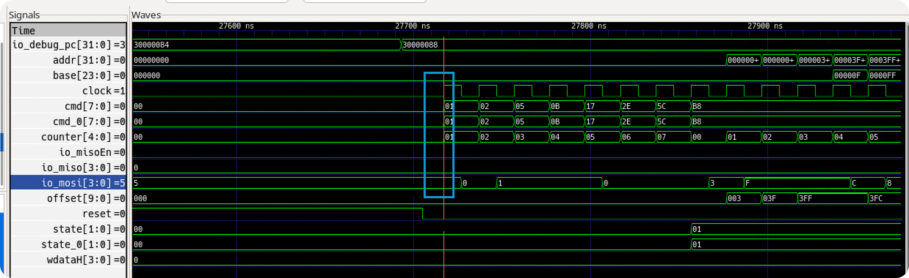
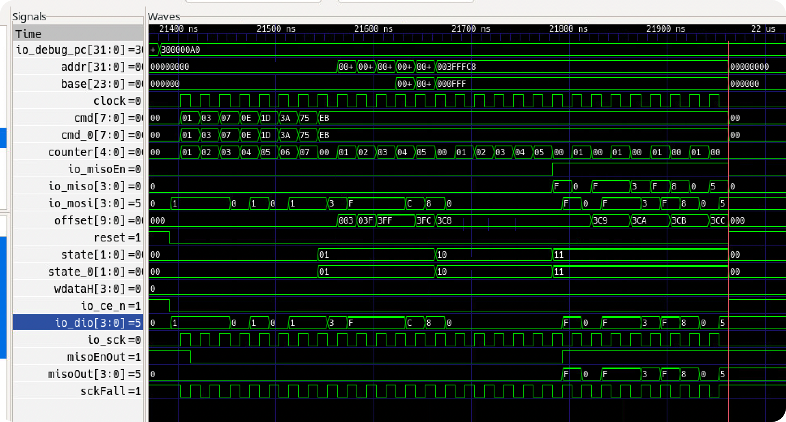

# BUG REPORT: 未复位的 misoEnOut 导致命令字采样错误

## 问题描述

在一次读操作结束后, 紧接着的写操作中, QSPI Slave 端的 PSRAM 收到了错误的命令字, 触发了断言失败. 关键在于: 此前的多次操作均正常, 唯独这一次出现了异常.

具体表现为在写入操作时, PSRAM 内部的 assert 被触发:

```
Welcome to riscv32-NPC!
For help, type "help"
[0] %Error: Impl_2_Verification_Assert.sv:26: Assertion failed in TOP.NPCSoC.dut.psram.module_0.verification_assert: Assertion failed: Assert failed: Unsupportted command `b8`

%Error: /home/wangfiox/Documents/ysyx-workbench/npc/build/verification/assert/Impl_2_Verification_Assert.sv:26: Verilog $stop
Aborting...
make[3]: *** [scripts/native.mk:124: run] Error 1
make[2]: *** [Makefile:134: run] Error 2
make[1]: *** [/home/wangfiox/Documents/ysyx-workbench/abstract-machine/scripts/platform/npc.mk:63: run] Error 2
test list [1 item(s)]: bit
[           bit] ***FAIL***
make: *** [Makefile:28: run] Error 1
```

该 assert 来自于对命令字合法性的校验:

```scala
class psram extends RawModule {
  ...
  class Impl extends Module with RequireAsyncReset {
    ...
    switch(state) {
      ...
      is(State.addr) {
        when( counter === 5.U ) {
          ...
          assert( cmd === "heb".U || cmd === "h38".U, cf"Assert failed: Unsupportted command `${cmd}%x`" )
        }
      }
    }
  }
}
```

## 排查过程

收到的错误命令字为 `0xb8`. 通过反汇编定位, 确认这是一条 `sw` (store word) 指令发起的写操作:

```
30000088:       00812423                sw      s0,8(sp)
```

> 注: 此处 trace 信息不够完善 —— 该 assert 来自 SystemVerilog 侧, 与仿真平台 C 语言层面的 assert 来源不同, 未能被仿真平台捕获. 后续应在仿真平台中捕获 `SIGABRT` 信号以改进可观测性.

### 波形分析

拉取本次写操作的波形如下:



参考 66-67WVS4M8ALL-BLL 数据手册, PSRAM 配置为 SPI Mode 0 (CPOL=0, CPHA=0): 在 SCK 上升沿采样 MOSI 并更新内部状态, 在 SCK 下降沿驱动 MISO.

从波形中可以观察到: 在第一个 SCK 上升沿, MOSI 的值为 `0x5`, 其最低位 `mosi(0) = 1`. 因此采样到的命令字变为 `0b1011_1000` (`0xb8`), 而非预期的 `0b0011_1000` (`0x38`).

### 根因定位

那么 MOSI 上为何出现了 `0x5`? 观察上一次读操作的波形:



可以发现: 上一次读操作结束时, MISO 的输出值恰好为 `0x5`.

同时注意到 `class psram extends RawModule` 中的 `misoEnOut` 信号在片选 (CS#, 低电平有效) 拉高后仍然保持高电平, 这是不正确的.

**问题根因**: DIO 数据线通过三态门被分解为 MISO 和 MOSI 两个方向:

- 当 `misoEnOut` 为低时, 三态门高阻, `mosi = dio` (Master 写方向)
- 当 `misoEnOut` 为高时, 三态门导通, `dio = miso` (Slave 写方向)

66-67WVS4M8ALL-BLL 的通信模型是半双工的: 在一次传输中, 先由 Master 写命令和地址, 再由 Slave 回写数据. 当新一轮传输开始 (片选有效) 时, 应当首先由 Master 写入, 此时 `misoEnOut` 应为低.

然而由于 `misoEnOut` 未被正确复位, 上一次读操作残留的高电平延续到了本次写操作的开头, 导致 Slave 和 Master **同时驱动同一根数据线**. 在真实电路中, 这种竞争会产生不定态 (X). 但 Verilator 采用二值逻辑 (0/1) 仿真, 无法表达四值逻辑 (0, 1, X, Z) 中的不定态, 因此掩盖了这一冲突, 使得问题更加隐蔽.

## 修复方法

为 `RegNext` 添加复位初始值, 确保 `misoEnOut` 在复位后默认为低电平 (Master 写方向):

```diff
-  val misoEnOut = withClockAndReset(sckFall, reset) { RegNext(module.io.misoEn) }
+  val misoEnOut = withClockAndReset(sckFall, reset) { RegNext(module.io.misoEn, false.B) }
```

## 反思

这个 bug 的成因有两方面:

1. **对 Chisel API 不够熟悉**: `RegNext` 在不提供第二个参数 (复位值) 时, 寄存器不会被复位, 上电后的初始值是不确定的.
2. **Verilator 二值仿真的局限性**: Verilator 使用二值逻辑仿真, 无法暴露信号竞争导致的不定态, 使得 bug 表现为偶发的数据错误而非明确的 X 传播, 大大增加了排查难度.
3. **Fault 不等于 Failure**: 这个 bug 实际上影响所有的 write-after-read 场景 —— 每次 read 结束后 `misoEnOut` 都会残留为高电平. 然而此前的几次 write-after-read 并未触发异常, 原因是那几次恰好 `miso(0) = 0`, 与 Master 发送的命令字最低位一致, 掩盖了总线竞争的影响. 这正是软件工程中经典的 fault / error / failure 三层模型: **fault** (缺陷) 始终存在, 但只有在特定数据模式下才会引发 **error** (错误状态), 进而触发可观测的 **failure** (失效).

这个 bug 前后排查了将近一周 (期间恰逢春节, 休息了几天). 在此过程中阅读了大量 SPI 协议相关资料, 收获颇丰. 同时也用 Chisel 重写了一份基于 APB 总线的 [QSPI Master](https://github.com/KINGFIOX/spi-master) (参考 `./perip/spi`). 
主要是一开始我认为是 eftables 的 qspi-master 有问题, 因为 mosi 就是从 master 传到 psram 的,
并且 psram 经过一些简单的单元测试后, 并没有什么问题.
并且考虑到后续还要升级为 qpi-master,
所以我花了许多时间理解 ./perip/eftables 下的 qspi-master 代码
(已删除, 替换成了用 chisel 重写的 opencores 风格的版本).
